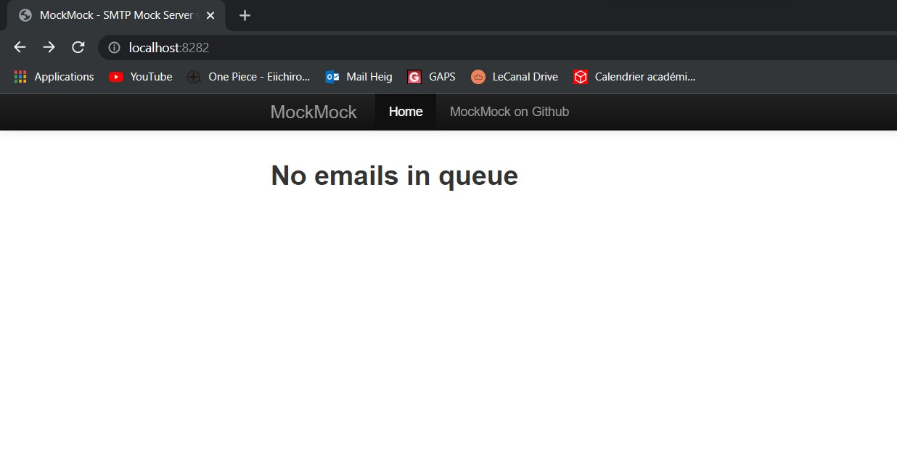
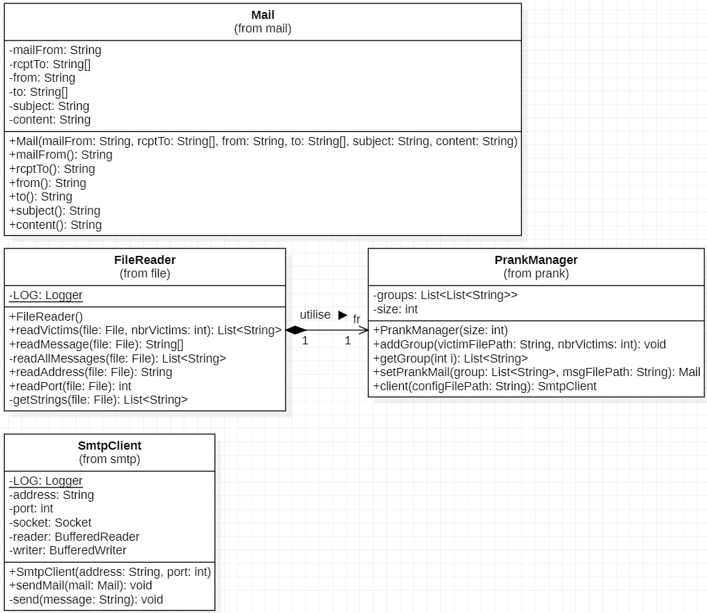

# Rapport Labo SMTP
## Dorian Gillioz et Oscar Baume

## Description du projet
Ce projet permet d'envoyer des emails piégés à des groupes de personnes. Les groupes
de personnes sont donnés en paramètre du programme dans un fichier texte. On peut
spécifier en paramètre le nombre de groupes et le nombre de personnes dans les groupes.
Le dernier paramètre permet d'indiquer le chemin contenant le fichier texte avec tous
les messages possibles. Le programme va sélectionner n personnes au hasard pour former 
un groupe et va ensuite envoyer un message au hasard. Les victimes auront l'impression
qu'une autre victime du groupe leur a envoyé ce mail.

## Qu'est-ce que MockMock ?
MockMock est un serveur SMTP en Java qui permet de tester l'envoi de mail sans réellement
en envoyer afin de voir à quoi ressemblerait le mail. Une interface web est fournie qui 
permet de voir le contenu des mails envoyés. C'est un serveur fictif qui n'envoi pas de 
mails aux destinataires du mail.

## Prérequis pour utiliser l'application
Avoir java, maven et docker installé.

## Comment mettre en place le serveur MockMock ?
Pour mettre en place le serveur MockMock, il faut aller dans le répertoire docker à la racine 
du projet, ouvrir une invite de commande dans ce répertoire et exécuter dans un premier temps le 
script `build-image.sh`, ce script permet de créer le container docker contenant le serveur. 
Une fois le container créé, il faut exécuter le script `run-container.sh`. Ce script lance 
le serveur SMTP. Le serveur peut être accédé soit via l'interface web sur le port 8282 à l'adresse
localhost, soit via la commande `telnet localhost 25`.

L'interface web une fois lancée devrait ressembler à ça.



La commande exécutée devrait avoir cet affichage. Le telnet permet d'envoyer une requête SMTP, mais
ne sera pas utile dans l'exécution de notre programme, car c'est le programme qui va s'en occuper.


## Comment utiliser l'application pour faire un prank
Pour compiler le programme et créer son fichier exécutable .jar, il faut effectuer la commande 
`mvn clean install` à la racine du projet. L'exécutable .jar se situera dans le répertoire 
`target`. 

**Attention :** Pour que le programme ait accès aux configurations du serveur, le .jar doit rester
dans le répertoire `target`.

L'application de prank a besoin de 4 paramètres pour s'effectuer correctement :
1. Le nombre de groupes à créer pour leur envoyer des mails. Il doit être entier
2. Le nombre de personnes par groupe. Il doit être >= 3 et entier.
3. Le chemin contenant les emails des personnes à piéger. Il doit avoir un email par ligne
pour être correctement lu. Le chemin indiqué doit être absolu.
4. Le chemin contenant les messages à envoyer. Le format pour qu'il soit considéré comme 
un mail est le suivant :
```
Objet du mail
Contenu du mail
---
```
Les trois tirets permettent d'indiquer la fin du message, mais il n'est pas nécessaire de 
l'indiquer quand il s'agit du dernier message du fichier.

Une fois ces paramètres correctement donnés, un mail par groupe, constitué de n personnes 
passé en paramètre, va être envoyé contenant un message du fichier choisi au hasard.

_Note :_ Des exemples de fichiers pour les messages et les emails se situent respectivement dans 
les répertoires `config/messages/messages.txt` et `config/victims/victims.txt`.

Exemple d'exécution :
```
C:\...\DAI-2022-SMTP\target>java -jar APPLICATION.jar 2 3 C:\...\victims.txt C:\...\messages.txt
Mail #1 :
220 host.docker.internal ESMTP MockMock SMTP Server version 1.4
EHLO localhost
250-host.docker.internal
250-8BITMIME
250 Ok
MAIL FROM: michel@gmail.com
250 Ok
RCPT TO: michel@gmail.com
250 Ok
RCPT TO: alice@gmail.com
250 Ok
RCPT TO: guisep@outlook.com
250 Ok
DATA
354 End data with <CR><LF>.<CR><LF>
Content-Type: text/plain; charset="utf-8"
From: michel@gmail.com
To: alice@gmail.com, guisep@outlook.com
Subject: Bonjour

bonjour,
ceci est un mail
.
250 Ok

Mail #2 :
220 host.docker.internal ESMTP MockMock SMTP Server version 1.4
EHLO localhost
250-host.docker.internal
250-8BITMIME
250 Ok
MAIL FROM: alice@gmail.com
250 Ok
RCPT TO: alice@gmail.com
250 Ok
RCPT TO: francois@yahoo.fr
250 Ok
RCPT TO: bob@gmail.com
250 Ok
DATA
354 End data with <CR><LF>.<CR><LF>
Content-Type: text/plain; charset="utf-8"
From: alice@gmail.com
To: francois@yahoo.fr, bob@gmail.com
Subject: Yahoooo

Yipyiipyiypy
.
250 Ok

```


## Implémentation du projet
Le projet est divisé en 4 classes différentes qui vont chacun gérer un aspect différent de l'application.

### Diagramme de classe :


### Record (Classe) Mail
Le record Mail contient toutes les informations à écrire dans un mail à envoyer. C'est-à-dire 
l'émetteur et les destinataires pour la partie MAIL FROM, RCPT TO et Data, l'objet et le
contenu du mail.

### Classe FileReader
La classe FileReader permet la lecture des fichiers et le traitement du contenu des fichiers
pour paramétrer les mails piégés avec les bons formats.
``` java
List<String> readVictims(File file, int nbrVictims)
```
Cette fonction permet de lire tous les emails dans le fichier donné en paramètre et va 
ensuite prendre `nbrVictims` email dans ce fichier et les retourner dans une `List<String>`.
La fonction va aussi vérifier que les emails donnés ont un format correct.

``` java
String[] readMessage(File file)
```
Cette fonction permet de récupérer un message au hasard parmis tous les messages dans 
le fichier donné. La valeur de retour est un `String[]` qui contient en premier élément
l'objet du mail et en deuxième le contenu du message. Elle récupère la liste de tous les 
messages depuis la fonction `readAllMessages()` qui retourne une liste avec une ligne par message.

``` java
String readAddress(File file)
int readPort(File file)
```
Ces deux fonctions ont un fonctionnement similaire : elles vont récupérer dans un fichier config
l'adresse du serveur et son port. Pour l'adresse, la fonction va chercher dans le fichier le 
format `ip=address` et pour le port, le format `port=port`.

### Classe PrankManager
Cette classe permet de préparer le piège à envoyer en mettant en place les groupes de victimes,
grâce à la fonction `addGroup()`,et en préparant les mails piégés à envoyer.

``` java
Mail setPrankMail(List<String> group, String msgFilePath)
```
Cette fonction va retourner un objet `Mail` contenant toutes les informations pour piéger.
La liste des personnes à piéger est définie dans le paramètre `group` et le message à envoyer
va être sélectionné au hasard depuis le paramètre `msgFilePath`. L'émetteur choisi sera la 
première personne dans le groupe passé en paramètre.

``` java
SmtpClient client(String configFilePath)
```
Cette fonction va retourner un objet `SmtpClient` qui est instancié sur les infos du serveur données depuis 
le fichier donné par le paramètre `configFilePath`.

### Classe SmtpClient
Cette classe permet de se connecter au serveur Smtp donné grace au constructeur et d'envoyer le mail donné. 
Elle gère les interactions entre le client et le serveur.

``` java
void sendMail(Mail mail)
```
Cette fonction va se connecter au serveur et va envoyer le mail donné en paramètre.

``` java
void send(String message) 
```
Cette fonction permet d'envoyer un message au serveur.

### Exemple interaction client-serveur

- En vert : Réponses du serveur
- En orange : Commandes du client
  - `EHLO localhost` : Initie la conversation SMTP
  - `MAIL FROM:` et `From:` : Correspond au premier mail du groupe des victimes
  - `RCPT TO:` : Mails des victimes
  - `DATA` : Début du message
  - `Content-Type:` : Format d'encodage du mail => UTF-8
  - `To:` : Mails des victimes sans le faux émetteur
  - `Subject:` : Objet du mail
  - Le reste jusqu'au `.` correspond au contenu du message